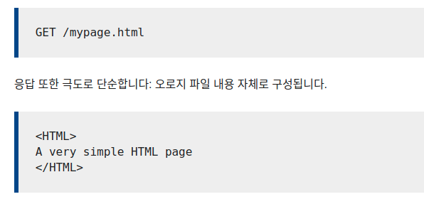
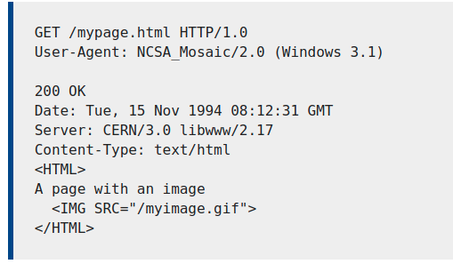
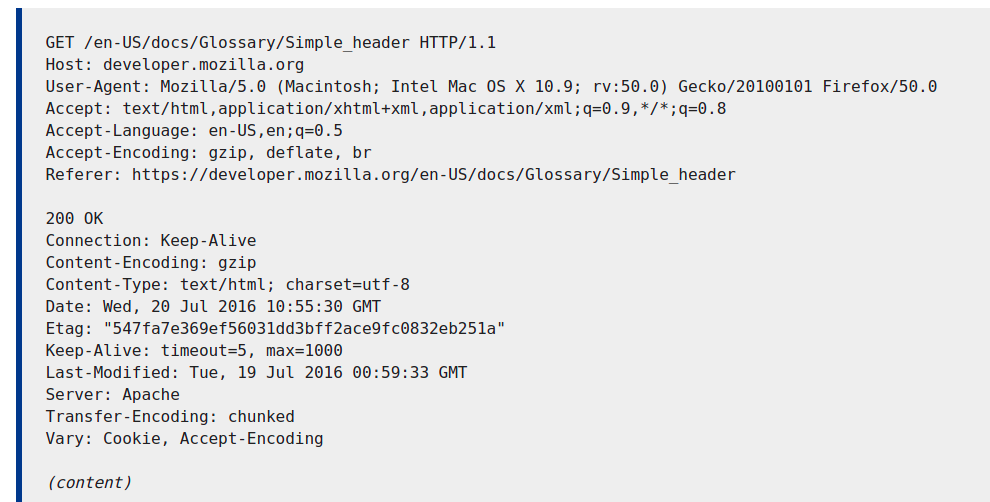
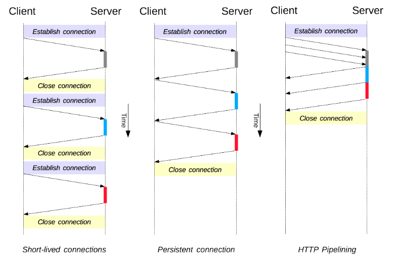
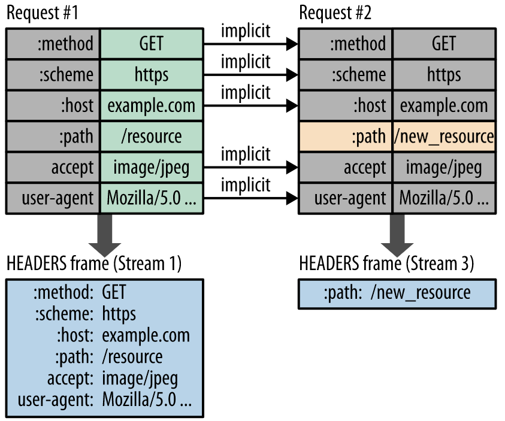
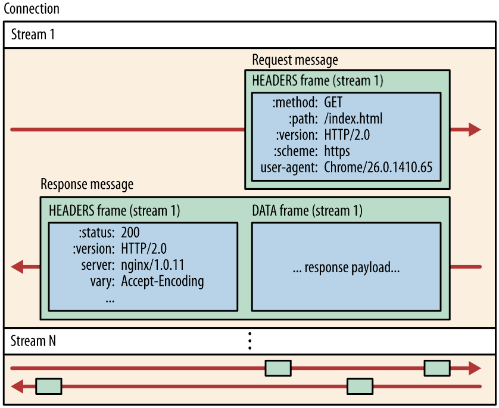
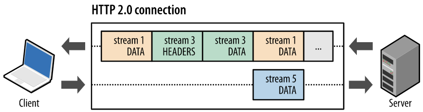
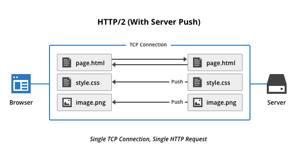
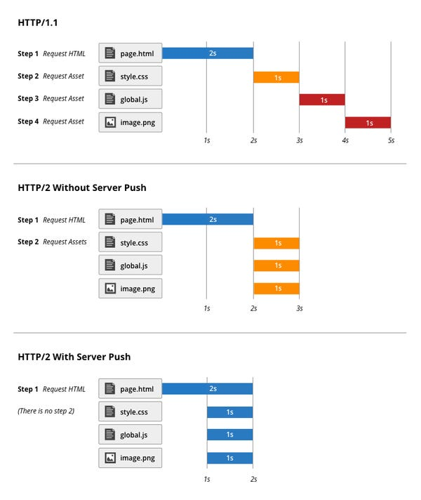
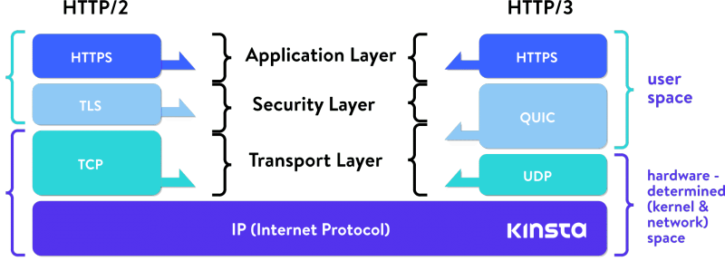

#### 작성자 : *Odreystella*

# HTTP와 HTTPS

### 1. HTTP?
   - 웹 상에서 클라이언트와 서버 간 통신을 위한 프로토콜

### 2. HTTP 특징
   - 단방향성 : 클라이언트가 서버로 요청을 보내고 이에 대한 응답을 받는 단방향적 통신, 서버가 먼저 요청보낼 수 없음
   - 비연결성 : 연결이 계속 유지되지 않고 요청에 대한 응답이 끝나면 연결을 끊음, 소켓통신과 반대되는 특징
   - 무상태성(stateless) : 클라이언트가 서버와 연결된 상태가 아니기 때문에 기본적으로 상태를 가지지 않음, 이를 보완하기 위해 쿠키, 세션, 토큰등을 사용함

### 3. HTTP Headers

### 4. HTTP 응답 상태 코드

### 5. HTTP 캐시

### 6. HTTP/0.9
   </img>
   - GET method만 존재 
   - 헤더가 존재하지 않음
   - HTML 파일만 전송 가능
   - connection 당 하나의 요청, 하나의 응답만 처리 가능 -> 매번 새로운 연결로 성능 저하, 서버 부하 비용 증가
  
### 7. HTTP/1.0
   </img>
   - 헤더 생김
   - 응답 헤더에 상태 코드 추가
   - Content-Type가 추가되면서 HTML파일 외에 다른 문서 전송 가능(이미지 등)
   - TCP에서 3-way-handshake 도입
   - connection 당 하나의 요청, 하나의 응답만 처리 가능 -> 매번 새로운 연결로 성능 저하, 서버 부하 비용 증가

### 8. HTTP/1.1(TCP기반)
   </img>
   - **Persistent Connection** 도입
     - 의미: 지정한 timeout 동안 connection을 닫지 않는 방식 -> 한 connection 에서 여러 요청 가능
     - 문제점: 다음 요청을 보내기 위해서는 이전 요청의 응답이 도착해야 함
     - 해결책: Pipelining 도입

   - **Pipelining** 도입
     - 의미: 하나의 connection에서 응답을 기다리지 않고, 순차적인 여러 요청을 연속적으로 보내 그 순서에 맞춰 응답을 받는 방식으로 지연 시간을 줄임
     - 문제점:  연속 요청에 대한 헤더 중복, Head Of Line Blocking발생, 컴퓨터 네트워킹에서 패킷 대기열이 존재할 때, 처음 요청 다음 도착한 요청에 대한 처리가 늦어짐 -> 병목현상 발생 -> latency 증가 -> TCP성능 저하
     - 해결책: 도메인 샤딩 방식 도입

   - **도메인 샤딩 방식**
     - 의미:
     - 문제점 : 도메인마다 connection을 맺고 끊음, 상당한 시간과 대역폭 소모, 연결할 수 있는 connection 수의 제한
     - 해결책 : 성능면에서 근본적인 문제가 해결되지 않아 HTTP2.0으로 발전
   - **connection 변화**
   </img> 

### 9. HTTP/2.0(TCP기반)
   - 2015년 등장
   - 기존 HTTP/1.x버전의 **성능 향상**에 초점을 맞춘 프로토콜
   - **HTTP 메시지 전송 방식의 변화(바이너리 프레이밍 계층 사용)**
   - 바이너리 프레이밍 계층에서 프레이밍이라는 단위로 메시지를 분할, 바이너리로 인코딩 -> 파싱, 전송속도 증가, 오류 발생 가능성 감소
   </img>

   - **헤더 데이터 압축 가능**
   </img>

   - **스트림, 메시지 및 프레임 교환 방식**
      - Frame:
      - Message:
      - Stream: 	  
   </img>
   - 리소스간 우선 순위 설정 가능(스트림에 우선순위 가중치 줄 수 있음)

   - **멀티플렉싱**
      - 하나의 connection에서 여러 요청과 응답 병렬 전송 가능 -> Head Of Line Blocking 해결 
   </img>
   </img>

   - **서버 푸쉬 기능** 
      - HTML 파싱하면서 필요한 리소스(js, css,png..)재요청 하지 않아도 서버가 알아서 보내주기 때문에 웹사이트가 완성되는 속도가 빨라짐
   </img>
   </img>
   - 한계 : TLS기반이기 때문에 TCP의 3-way-handshake와 TLS의 handshake가 동시에 일어나서 성능 저하
   </img>

### 10. HTTP/3.0(UDP기반)
   </img>
   </img>

### 11. 참고 
   - https://support.cloudflare.com/hc/en-us/articles/115002816808-How-do-I-enable-HTTP-2-Server-Push-in-WordPress
   - https://developer.mozilla.org/ko/docs/Web/HTTP/Connection_management_in_HTTP_1.x
   - https://developer.mozilla.org/ko/docs/Web/HTTP/Basics_of_HTTP/Evolution_of_HTTP
   - https://www.youtube.com/watch?v=xcrjamphIp4&list=PLgXGHBqgT2TvpJ_p9L_yZKPifgdBOzdVH&index=55
   - https://www.youtube.com/watch?v=uhlvXrDpM-Y&list=PLgXGHBqgT2TvpJ_p9L_yZKPifgdBOzdVH&index=91&t=265s

  

