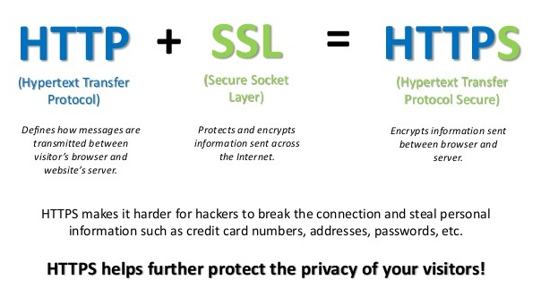

#### 작성자 : *Odreystella*

# HTTP와 HTTPS 동작 과정(HTTPS와 SSL)

### 1. HTTP(Hypertext Transfer Protocol)
   - Hypertext인 HTML을 전송하기 위한 통신규약을 의미
   - http://www.domainname.com -> www.domainname.com에 해당하는 컴퓨터를 이용할 건데 http 프로토콜을 이용해 통신하겠다라는 의미

### 2. HTTPS(Hypertext Transfer Protocol Secure(Over Secure Socket Layer))
   - HTTP보다 보안장치가 결합되어 있는 통신규약, 제3자가 데이터를 도청할 수 없음  
   

### 3. HTTPS vs. SSL
   - 엄밀히 따지면 다름
   - SSL위에서 HTTPS가 동작하기 때문
   - SSL이라는 통신방법 위에서 동작하는 서비스 중 하나인 HTTP가 SSL을 이용하게 되면 HTTPS  
   </img>
   </img>

### 4. SSL vs. TLS
   - 같은거
   - 네스케이프에 의해 SSL발명, 보편적으로 사용되다가 표준화 기구인 IETF로 이관되면서 TLS로 이름이 바뀜
   - 정식명칭은 TLS이지만 실제로는 SSL이라는 이름이 훨씬 많이 사용되고 있음
   - 통신 내용이 암호화되어 있기 때문에 노출되어도 공격자는 알 수 없고, 내가 접속한 서버를 신뢰할 수 있음
   - 대칭키와 공개키 방식을 혼합해서 사용함

### 5. 암호화의 종류
   - **대칭키** 방식: 암호화할 때 사용한 키와 **동일한 하나의 키**로 복호화하는 방식
   - 문제점: 암호화된 데이터를 전송할 때 키를 함께 보내야 하기 때문에, 중간에 키가 노출되면 데이터가 노출되어 보안에 취약함
   - 알고리즘 방식 : DES, 3-DES, AES, SEED, ARIA, MASK 등  
   </img>

   - **공개키** 방식: **한 쌍(공개키, 개인키)의 키가 존재**, 공개키로 암호화한 데이터를 개인키로 복호화 하는 방식
   - 장점 : 키 관리가 쉽고, 키가 공개되어도 상관 없음, 메시지 암호화 이외에 전자서명에 사용 가능
   - 단점: 대칭키에 비해 크기가 상대적으로 커서 암호화/복호화 시간이 많이 걸림
   - 알고리즘 방식 : RSA, DSA 등  
   </img>

### 6. 공개키 방식으로 메시지 암호화
   - **송신자가 수신자의 공개키**로 메시지를 **암호화** 해서 보내면 수신자는 자신의 **개인키로 복호화**하여 메시지를 확인할 수 있음
   - **공개키**로 암호화하면 **데이터 보안**에 중점을 둔 것  
   </img>

### 7. 공개키 방식으로 전자서명
   - **인증**을 위해 개인키를 소유한 송신자가 **개인키로 서명**한 후 공개키와 함께 전송하면 **수신자는 공개키로 검증**, 공개키로 복호화가 된다면 공개키와 쌍을 이루는 개인키에 의해 암호화된 것을 보증하는 것
   - **개인키**로 암호화하면 **인증** 과정에 중점을 둔 것  
   </img>

### 8. SSL 인증서
   - 클라이언트와 서버간의 통신을 제 3자가 보증하는 전자화된 문서.
   - 역할 : 1) 클라이언트가 접속한 서버가 신뢰할 수 있는 서버임을 보장하는 것, 2) SSL 통신에 사용할 공개키를 클라이언트에게 제공하는 것
   - CA(Certificate Authority) : 해당 사이트의 신뢰성을 인정하고 인증서를 발급해 주는 공인된 기관, 각 브라우저마다 CA목록을 가지고 있음(Symantec with 42.9% market share, Comodo with 26%, GoDaddy with 14%, GlobalSign with 7.7%)
   - 클라이언트가 신뢰할 수 있는 서버인지 탐색하는 과정(handshake)에서 **서버에 설치된 인증서**를 전달하고, 브라우저가 이를 판단함(브라우저는 CA목록과 각 CA의 공개키를 알고 있음)
   - 인증서 내용 : 1) 서비스의 정보(인증서를 발급한 CA, 서비스의 도메인 등), 2) **서버 측 공개키**
   - CA에 제출한 인증서의 내용은 CA의 개인키를 이용해 암호화함, CA의 개인키는 절대 유출되어서는 안됨

### 9. CA와 브라우저가 특정 서버를 인증하는 과정
   1. 웹 브라우저가 url을 통해 서버에 접속할 때 서버는 제일 먼저 인증서를 제공함
   1. 브라우저는 이 인증서를 발급한 CA가 자신이 보유한 CA목록에 있는지 확인함
   1. 포함되어 있다면, 서버가 제공한 인증서(인증서의 내용은 CA의 개인키로 암호화됨)는, 해당 CA의 공개키로 복호화할 수 있음
   1. 복호화가 된다면, 해당 CA의 개인키에 의해 암호화되었다는 의미이고, 개인키는 해당 CA만 가지고 있기 때문에 서버가 제공한 인증서가 해당 CA에 의해서 보증받았다는 것을 의미함, 즉 신뢰할 수 있는 사이트라는 의미.

### 10. SSL 동작방법
   - 공개키와 대칭키를 혼합해서 사용
   - 실제 데이터 : 대칭키 방식으로 암호화(속도 문제 해결)
   - 대칭키의 키 : 공개키 방식으로 암호화(키 공유 문제 해결)
   - 네트워크 통신 단계 : handshake -> 전송(세션) -> 세션종료  
   </img>
   - ***handshake 단계(인증서 전달, 세션키 생성)**
      - 1. 클라이언트가 url을 통해 서버에 접속함. 이때, 클라이언트 측에서 생성한 랜덤 데이터와 클라이언트가 지원하는 암호화 방식들을 전달함(기존에 SSL 핸드쉐이킹을 했다면 세션 아이디를 활용함)
      - 2. 서버는 서버측에서 생성한 랜덤 데이터, 클라이언트의 암호화 방식 중 서버가 선택한 방식, **인증서**를 전달함
      - 3. 전달 받은 인증서는 위 9번의 과정을 참고, 성공하면 SSL 세션 생성
      - 4. 클라이언트가 서버를 신뢰할 수 있게 되면, 클라이언트가 생성한 랜덤 데이터와 서버가 생성한 랜덤 데이터를 조합하여 pre master secret키 생성 -> 인증서에 포함된 서버의 공개키로 암호화하여 전달(pre master secret로 대칭키를 생성할 것이기 때문에 노출되면 안됨)
      - 5. 서버는 pre master secret를 자신의 개인키로 복호화함, 클라이언트와 서버는 안전하게 pre mastersecret를 공유하게 되었고, 일련의 과정을 거쳐 master secret값 생성 -> master secret는 **세션키를 생성**함(클라이언트와 서버 둘다 동일한 세션키를 가지게 됨)
      - 6. 클라이언트와 서버는 handshake 단계의 종료를 서로에게 알림

   - ***전송(세션) 단계(실제 데이터를 주고 받음)**
      - 1. 클라이언트는 전송할 데이터를 세션키를 이용해서 대칭키 방식으로 암호화하여 전달함
      - 2. 서버도 세션키를 알고 있기 때문에 해당 키로 데이터를 복호화함
      
   - ***세션 종료 단계**
      - 1. 데이터의 전송이 끝나면 SSL 통신이 끝났음을 서로에게 알림
      - 2. 통신에서 사용한 대칭키인 세션키를 폐기함

### 11. 참고 
   - https://opentutorials.org/course/228/4894
   - https://jennana.tistory.com/45?category=928033
   - https://m.blog.naver.com/chodahi/221406287669
   - https://blog.naver.com/adtkorea77/222278182016

